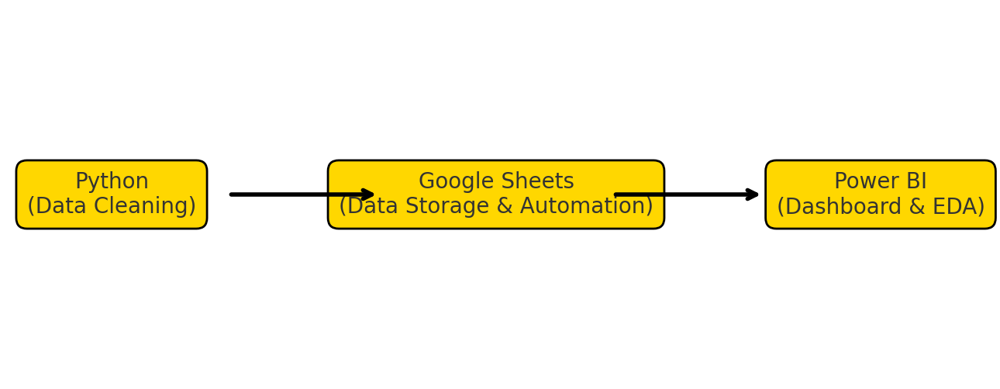

# 📊 Data Analyst Job Market Dashboard  

## 📝 Executive Summary  
This project explores the **Data Analyst job market** by analyzing thousands of job postings. The goal was to uncover **top skills, salary trends, company hiring patterns, and sector-specific requirements**. The end result is an interactive **Power BI dashboard** that provides insights for both job seekers and employers.  

---

## ❓ Business Problem  
The job market for data analysts is vast and competitive.  
- Job seekers struggle to identify which **skills are most in demand**.  
- Salaries vary widely depending on **location, role, and company size**.  
- Companies want to understand how they compare with the industry in terms of **hiring and salaries**.  

This project aims to bridge that gap with **data-driven insights**.  

---

## 🔍 Methodology  
1. **Data Cleaning (Python – Pandas & NumPy):**  
   - Cleaned raw job posting data.  
   - Extracted relevant information such as job titles, salaries, company size, and sector.  
   - Performed text extraction to pull out skills from job descriptions.  

2. **Data Storage & Automation:**  
   - Uploaded cleaned data to **Google Sheets** for automatic updates.  

3. **Exploratory Data Analysis (EDA):**  
   - Analyzed hiring trends, skill requirements, and salary distributions.  
   - Explored correlations between job roles, skills, and pay.  

4. **Dashboard Development (Power BI):**  
   - Connected Power BI to Google Sheets.  
   - Built interactive dashboards showing skills, salaries, job locations, and company hiring patterns.  

---

## 🛠️ Skills & Tools Used  
- **Python** (Pandas, NumPy, Regex – for cleaning and extracting skills)  
- **Google Sheets** (data automation & storage)  
- **Power BI** (dashboard building, EDA, visualization)  
- **Data Analytics** (EDA, business insights, visualization design)  

---

## 📊 Project Workflow  

  

---

## 📈 Results & Insights  
- **SQL, Excel, and Python** are the most in-demand skills.  
- Finance and IT sectors hire the most data analysts.  
- Salaries are highest in **San Jose, CA** and **San Francisco, CA**.  
- Mid-sized companies (51–200 employees) posted the most job listings.  

---

## 💡 Business Recommendations  
- **For Job Seekers:** Focus on strengthening SQL, Excel, Python, and visualization tools like Tableau/Power BI to increase employability.  
- **For Companies:** Highlight competitive salaries and in-demand tools in job postings to attract top talent.  
- **For Training Providers:** Invest in courses around SQL, Excel, and Tableau, as these remain highly marketable.  

---

Preview : 
